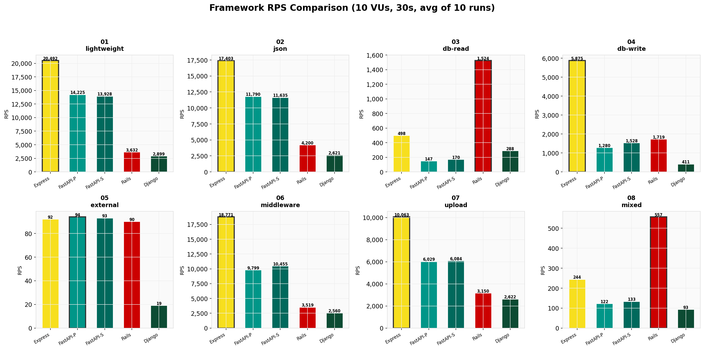
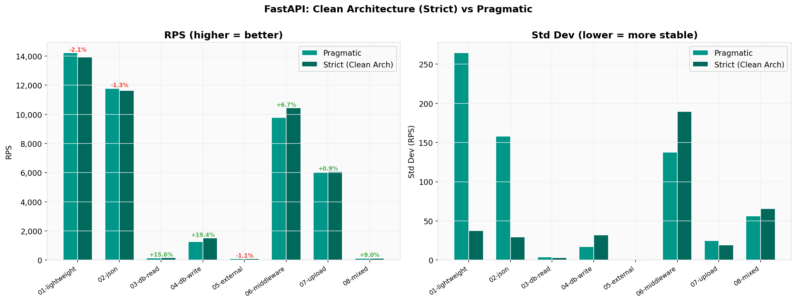
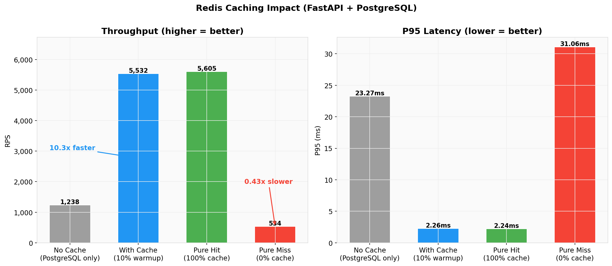
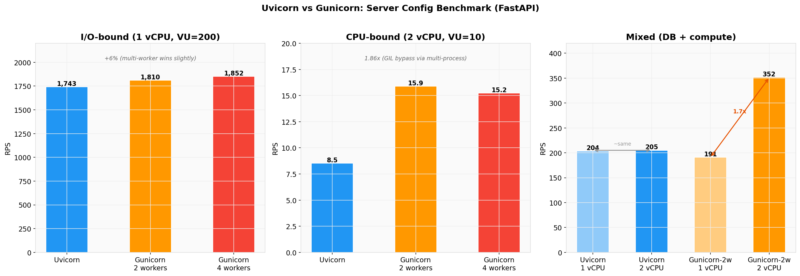

# Backend Benchmark Lab

[](README.en.md)

> **"동일한 로직, 서로 다른 구현"** — 같은 API를 여러 백엔드 프레임워크로 구현하고 실제 시나리오에서 성능을 비교한 실험실

## 하이라이트

- **4개 언어, 5개 프레임워크**를 동일한 API 스펙으로 비교
- **26개 실전 시나리오**: "Hello World"가 아니라 N+1, 캐싱, 인증, 트랜잭션, 서버 구성까지 측정
- **105회 서버 구성 테스트**로 배포 튜닝이 프레임워크 선택만큼 중요하다는 점을 확인
- 모든 수치는 리소스 제한된 Docker 컨테이너에서 **k6 10회 반복 평균**



---

## 왜 만들었나

회사에서 FastAPI를 쓰고 있었지만, **왜 이 프레임워크를 선택했는지** 명확히 설명하기는 어려웠습니다. "빠르다"는 말은 많지만 어떤 상황에서 얼마나 빠른지, 다른 프레임워크와 구조적으로 무엇이 다른지는 직접 확인해보고 싶었습니다.

단순한 합성 벤치마크 대신 실전 시나리오를 만들고, **데이터를 바탕으로 기술 선택의 근거를 확보**하는 것이 목표였습니다.

---

## 프로젝트 구조

```
Backend-Benchmark-Lab/
├── implementations/          # 프레임워크별 구현체 (동일 API)
│   ├── python-fastapi-pragmatic/    # FastAPI — 실용적 아키텍처
│   ├── python-fastapi-strict/       # FastAPI — Clean Architecture
│   ├── python-django/               # Django — DRF ViewSet
│   ├── python-server-config/        # 서버 구성 실험
│   ├── typescript-express/          # Express.js + Prisma
│   └── ruby-rails/                  # Rails 8 API-only + ActiveRecord
│
├── scenarios/                # k6 벤치마크 시나리오 (26개)
│   ├── basic/                #   01-08: 프레임워크 비교
│   ├── db-advanced/          #   09-13: DB 최적화
│   ├── caching/              #   14-16: Redis 캐싱
│   ├── auth/                 #   17: JWT vs Session
│   ├── real-world/           #   18+: 집계, 검색 등
│   ├── server-config/        #   서버 구성 실험
│   └── stress/               #   스트레스 테스트
│
├── docs/                     # Claude가 작성한 스펙 (docs/README.md 참조)
│   ├── scenarios/            #   NN-{topic}.md — 시나리오·구현 가이드
│   ├── plans/                #   /tdd-plan 결과물
│   └── benchmark-results.md  #   RPS/Latency 비교표
│
├── learnings/                # 사용자 산출물 (learnings/README.md 참조)
│   ├── qna/                  #   시나리오별 Q&A
│   ├── retrospectives/       #   시나리오 완료 회고
│   ├── topics/               #   크로스커팅 심화 주제
│   └── DISCOVERIES.md        #   발견 로그 (시나리오 독립)
│
├── runner/                   # 자동화 스크립트
└── monitoring/               # Prometheus + Grafana
```

> 문서는 **작성 주체**를 기준으로 나눴습니다. `docs/`에는 Claude가 작성한 스펙·계획·결과표가 있고, `learnings/`에는 제가 직접 정리한 Q&A·회고·크로스커팅 심화가 있습니다. 전체 인덱스는 [`docs/README.md`](docs/README.md)와 [`learnings/README.md`](learnings/README.md)를 참조하세요.

---

## 기술 스택

| 영역 | 기술 |
|------|------|
| **벤치마크** | k6 (Grafana), 10 VUs, 30s, 10회 반복 평균 |
| **컨테이너** | Docker Compose (프로필 기반 전환) |
| **데이터베이스** | PostgreSQL 16 |
| **캐시** | Redis |
| **모니터링** | Prometheus + cAdvisor + Grafana |
| **API 스펙** | OpenAPI (Single Source of Truth) |

| 구현체 | 언어 | 프레임워크 | 서버 | ORM | 검증 |
|--------|------|-----------|------|-----|------|
| python-fastapi | Python 3.12 | FastAPI | Uvicorn | SQLAlchemy (async) | Pydantic |
| python-django | Python 3.12 | Django 5 | Gunicorn | Django ORM | DRF Serializer |
| typescript-express | TypeScript | Express | Node.js 22 | Prisma | Zod (선택적) |
| ruby-rails | Ruby 3.3+ | Rails 8 | Puma | ActiveRecord | — |

---

## 실험 환경

| 항목 | 값 |
|------|-----|
| 호스트 | Apple M5 Pro, 18 cores, 48 GB |
| 컨테이너 CPU | 2 cores (서버), 2 cores (DB) |
| 컨테이너 메모리 | 2 GB (서버), 1 GB (DB) |
| k6 VUs | 10 |
| k6 Duration | 30초 |
| 반복 횟수 | 10회 (평균 계산) |

> 모든 프레임워크에 동일한 리소스 제한을 적용해 비교 조건을 맞췄습니다.

---

## 프레임워크 구현 현황

| 프레임워크 | 아키텍처 | 구현 | 벤치마크 |
|-----------|----------|------|---------|
| FastAPI | Pragmatic | ✅ | ✅ |
| FastAPI | Strict (Clean Architecture) | ✅ | ✅ |
| Django | DRF ViewSet | ✅ | ✅ |
| Express | Pragmatic + Prisma | ✅ | ✅ |
| Rails 8 | API-only MVC | ✅ | ✅ |
| Go Fiber | — | — | — |

---

## 벤치마크 결과 (2026-03-27)

### 전체 비교: 5개 프레임워크 (RPS)

| 시나리오 | Express | FastAPI-P | FastAPI-S | Rails | Django |
|----------|---------|-----------|-----------|-------|--------|
| 01-lightweight | **20,492** | 14,225 | 13,928 | 3,632 | 2,899 |
| 02-json-payload | **17,403** | 11,790 | 11,635 | 4,200 | 2,621 |
| 03-db-read | 498 | 147 | 170 | **1,524** | 288 |
| 04-db-write | **5,875** | 1,280 | 1,528 | 1,719 | 411 |
| 05-external-api | 92 | **94** | 93 | 90 | 19 |
| 06-middleware | **18,771** | 9,799 | 10,455 | 3,519 | 2,560 |
| 07-file-upload | **10,063** | 6,029 | 6,084 | 3,150 | 2,622 |
| 08-mixed | 244 | 122 | 133 | **557** | 93 |

> Express는 경량 처리량에서 가장 앞섰지만, **DB 읽기(Express 대비 3배)와 혼합 워크로드(Express 대비 2.3배)에서는 Rails가 1위**였습니다. I/O 경계(05)에서는 비동기 프레임워크들의 결과가 비슷하게 수렴했고, Django는 동기 처리 때문에 외부 API 호출에서 병목이 생겼습니다.


### Rails: 예상을 뒤엎은 강자

- **DB 읽기 1위** — ActiveRecord의 효율적인 SELECT가 Prisma보다 높은 처리량을 보임 (1,524 vs 498 RPS)
- **혼합 워크로드 1위** — Puma의 멀티스레드 구조가 동시성 처리에서 강하게 작동 (557 vs 244 RPS)
- **가장 낮은 변동성** — 혼합 워크로드 변동계수 CV 5.8% (다른 프레임워크는 45% 이상)
- 경량 시나리오에서는 Ruby 인터프리터 오버헤드로 약세

### Clean Architecture: 성능 손실 없음

FastAPI Strict (Clean Architecture)는 Pragmatic 구현과 비교했을 때 **DB 쓰기에서 +19.4% 높은 처리량**을 보였고, 표준편차도 크게 줄었습니다(lightweight: 37 vs 265). 이 실험에서는 레이어 분리가 속도와 안정성 모두에 도움이 됐습니다.



### DB, 캐싱, 인증 핵심 결과

- **Cursor 페이지네이션**: 깊은 페이지에서 OFFSET 대비 1.7x 빠름 (인덱스 탐색 vs 전체 스캔)
- **Eager Loading (JOIN)**: N+1 문제 해결, 4.1x 향상 (쿼리 21개 -> 1개)
- **대량 INSERT (Raw VALUES)**: 개별 INSERT 대비 187x 빠름 (커밋 횟수가 핵심)
- **비관적 잠금**: 높은 동시성 환경에서 유일한 안전한 선택 (Serializable 성공률: 0.6%)
- **Redis 캐시 히트**: 10x 처리량 + tail latency 스파이크 제거
- **Session 인증이 JWT보다 14% 빠름** (Python) — GIL 때문에 CPU 바운드 JWT 검증이 비동기 Redis 조회보다 느림



### 서버 구성: Uvicorn vs Gunicorn (2026-03-02)

> 동일한 FastAPI 앱을 3가지 서버 구성(Uvicorn / Gunicorn+Uvicorn 2w / 4w)으로 측정했습니다. 5 Round × 35조합 × 3회 = **총 105 runs**

**가설 검증 결과**

| 가설 | 내용 | 결과 | 핵심 데이터 |
|------|------|------|------------|
| H1 | I/O-bound에서 비동기 단일 프로세스 우세 | **기각** | gunicorn-4w가 3~6% 우세, P99에서 13% 격차 |
| H2 | CPU-bound에서 멀티프로세스 우세 | **채택** | gunicorn-2w가 **1.86배** (GIL 우회) |
| H3 | 저사양에서 멀티프로세스 역효과 | **조건부 채택** | I/O → 역효과 없음, CPU → **98% 성능 하락** |

**Round별 핵심 결과**

| Round | 워크로드 | CPU | 승자 | 핵심 데이터 |
|-------|---------|-----|------|------------|
| R1 | I/O (sleep) | 1 vCPU | gunicorn-4w | +6% RPS, VU=200에서 P99 126→145ms 격차 |
| R2 | CPU (fibonacci) | 2 vCPU | gunicorn-2w | **1.86배** RPS, uvicorn P99=60초 타임아웃 |
| R3 | I/O (sleep) | 0.25 vCPU | ~동등 | 3가지 구성 모두 안정, 5% 이내 차이 |
| R4 | CPU (fibonacci) | 0.25 vCPU | uvicorn | **3.4배** — gunicorn-4w는 0.27 RPS |
| R5 | Mixed (DB+연산) | 1/2 vCPU | 상황별 | 1 vCPU: uvicorn, 2 vCPU: gunicorn-2w (1.7배) |

**배포 가이드**

| 워크로드 유형 | 1 vCPU 이하 | 2+ vCPU |
|--------------|-------------|---------|
| **I/O-bound** (API 호출, DB 쿼리) | Uvicorn 단독 | Gunicorn + N워커 (소폭 이득) |
| **CPU-bound** (연산, 해싱) | Uvicorn 단독 | **Gunicorn + N워커 필수** (N = vCPU 수) |
| **Mixed** (현실적 서비스) | Uvicorn 단독 | **Gunicorn + N워커 필수** (N = vCPU 수) |

**교훈**: (1) worker 수가 vCPU를 넘으면 CPU-bound에서는 장애에 가까운 성능 하락이 생긴다. (2) 단일 프로세스는 추가 CPU를 활용하지 못한다 — Uvicorn@1vCPU ≈ Uvicorn@2vCPU. (3) I/O-bound에서는 CPU 차이가 거의 드러나지 않았다 — 0.25 vCPU ≈ 1 vCPU 처리량.



---

## 핵심 인사이트

1. **"N배 빠르다"는 반쪽짜리 진실** — Express는 lightweight에서 Django보다 7배 빠르지만, DB 읽기와 혼합 워크로드에서는 Rails가 전체 1위.
2. **병목은 프레임워크가 아닐 때가 많다** — 최적화 우선순위: DB 쿼리 > 캐싱 > 인프라 설정 > 프레임워크 선택.
3. **Rails의 DB 성능은 예상 외로 강력하다** — ActiveRecord + Puma가 Express(Prisma) 대비 DB 읽기 3배, 혼합 워크로드 2.3배.
4. **Clean Architecture는 성능 손실이 없었다** — 오히려 DB 작업에서 15-19% 빠르고 분산이 훨씬 낮았다.
5. **서버 구성이 프레임워크 선택보다 중요할 수 있다** — 적절한 worker 설정만으로 1.86x 성능 향상.
6. **Python GIL이 JWT vs Session 성능을 역전시킬 수 있다** — Session이 14% 빠름. CPU 바운드 JWT 검증이 GIL 하에서 비효율적이었다.
7. **"쿼리 1개 = 더 빠르다"는 항상 맞지 않다** — ORM 3개 분리 쿼리가 Raw SQL 1개보다 1.4x 빨랐다. 옵티마이저가 쿼리별 최적 계획을 고른 영향으로 보인다.
8. **커밋 횟수가 대량 처리 성능을 크게 좌우한다** — Individual INSERT (2.98s) vs Raw VALUES (15.91ms) = 187배 차이.
9. **혼합 워크로드는 실제 트래픽에 가까운 대리 지표다** — 시나리오 08 결과(Rails 1위)가 프로덕션 트래픽 패턴을 가장 잘 대변한다고 봤다.

---

## 실행 방법

### 벤치마크 대상 시작

```bash
cd implementations

# 프레임워크 선택 (택 1)
docker compose --profile fastapi-pragmatic up -d
docker compose --profile fastapi-strict up -d
docker compose --profile django up -d
docker compose --profile express up -d
docker compose --profile rails up -d
```

### 벤치마크 실행

```bash
cd runner
./run-benchmark.sh python-fastapi-pragmatic    # FastAPI 전체 시나리오
./run-benchmark.sh typescript-express 05        # 단일 시나리오
./run-benchmark.sh ruby-rails 03+              # 03번부터 끝까지
```

### 모니터링 (선택)

```bash
cd monitoring
docker compose up -d
# Grafana: http://localhost:3000 (admin/admin)
```

---

## 로드맵

### 완료

- [x] 인프라 (Docker, k6, Prometheus + Grafana)
- [x] Basic 시나리오 01-08 (5개 프레임워크)
- [x] FastAPI Pragmatic vs Strict 아키텍처 비교
- [x] DB 심화 09-13 (Pagination, Column, N+1, Bulk, Transactions)
- [x] 캐싱 14-16 (Redis Hit/Miss)
- [x] 인증 17 (JWT vs Session)
- [x] 집계 18 (ORM vs Raw SQL)
- [x] 서버 구성 실험 (Uvicorn vs Gunicorn, 105회)
- [x] Ruby Rails 8 구현 + 벤치마크

### 예정

- [ ] Go Fiber 구현 + JWT vs Session 검증
- [ ] Flask, Fastify, NestJS 구현
- [ ] 텍스트 검색 (LIKE vs Full-text)
- [ ] E2E 플로우 (인증 -> 조회 -> 수정 -> 응답)
- [ ] Rails Solid Cache vs Redis 비교
- [ ] 스트레스 테스트 (스파이크, 장시간 부하)
- [ ] Pydantic vs msgspec, SQLAlchemy vs Raw asyncpg

---

## 라이선스

이 프로젝트는 [MIT 라이선스](LICENSE)로 제공됩니다.
