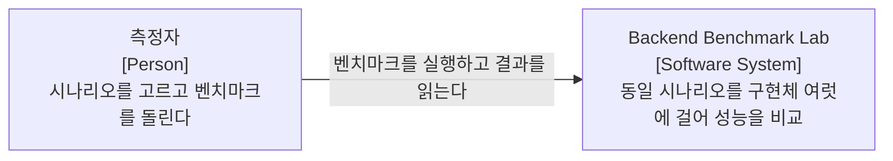
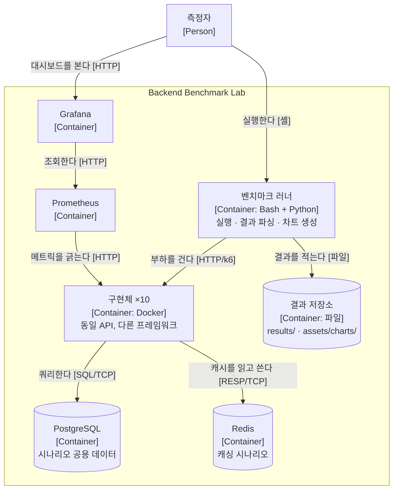

# Backend Benchmark Lab — 아키텍처 문서

> **arc42** 구성. 그림은 **C4 Model**. · **as of 2026-09-03** (`main`, 커밋 84)
> 근거: `implementations/` · `scenarios/` · `runner/` · `monitoring/` · `infra/` · `spec/openapi.yaml`
> 절에 적을 것이 없으면 비워두지 않고 `해당 없음 (날짜 검토). 이유: …` 를 적는다.

**갱신 트리거** — 구현체·시나리오가 늘거나 줄면 §1·§5 를 본다. `infra/` 가 바뀌면 §7 을 본다.

---

## 1. 목표

**서비스가 아니라 측정 하네스다.** 동일한 API 스펙을 여러 언어·프레임워크로 구현하고, 같은 시나리오를 걸어 처리량·지연·자원 사용을 비교한다.

**핵심 성질** — 「동일 로직, 다른 구현」. 비교가 유효하려면 **무엇을(WHAT)** 은 같고 **어떻게(HOW)** 는 각 프레임워크의 관용을 따라야 한다.

### 비교 대상

| 구현체 | 언어 | 프레임워크 | 서버 | 비고 |
|---|---|---|---|---|
| python-fastapi | Python | FastAPI | Uvicorn | 비동기 ASGI. **pragmatic / strict 2종** |
| python-django | Python | Django + DRF | Gunicorn | 동기 WSGI |
| python-flask | Python | Flask | Gunicorn | 동기 WSGI |
| typescript-express | TypeScript | Express | Node.js | 가장 보편적 |
| typescript-fastify | TypeScript | Fastify | Node.js | 성능 중심 |
| typescript-nestjs | TypeScript | NestJS | Node.js | 엔터프라이즈 |
| go-fiber | Go | Fiber | — | **성능 베이스라인** |
| ruby-rails | Ruby | Rails (API) | Puma | Convention over Configuration |
| java-spring-boot | Java | Spring Boot | Tomcat | 엔터프라이즈 표준 |
| kotlin-spring-boot | Kotlin | Spring Boot | Tomcat / Netty | ⏳ 예정 |

**FastAPI 를 pragmatic·strict 둘로 나눈 것이 이 랩의 성격이다** — 프레임워크 간 비교뿐 아니라 **같은 프레임워크의 설계 강도 차이**도 측정 대상이다.

### 서버 구성 실험 (Python)

Uvicorn 단독(1 worker) · Uvicorn 단독(N workers) · Gunicorn + Uvicorn. 워커 수 1 · 2 · 4 · 8 · (2×CPU+1).

**품질 목표**
> 해당 없음 (2026-09-03 검토). 이유: 이 시스템의 **산출물이 곧 성능 수치**라 「우리 시스템이 얼마나 빨라야 하나」라는 목표가 성립하지 않는다. 대신 **측정 신뢰도**가 품질이고, 그것은 §2 제약과 §8 이 지킨다.

## 2. 제약

| 제약 | 내용 |
|---|---|
| **비교 공정성** | 억지로 한 스타일로 맞추지 않는다. 각 언어·프레임워크의 **관용적 방식이 우선**이다. 스타일을 통일하면 비교 대상이 프레임워크가 아니라 스타일이 된다 |
| **API 동일성** | 모든 구현체가 `spec/openapi.yaml` 을 똑같이 만족해야 한다. 이게 깨지면 측정이 무효다 |
| **핸즈온 학습** | 구현 코드는 사람이 직접 타이핑한다 |
| **외부 의존 없음** | 전부 로컬 컨테이너에서 닫아 돈다. 네트워크 변동이 수치를 흔들지 않게 |

## 3. 컨텍스트와 범위



**외부 인터페이스**
> 해당 없음 (2026-09-03 검토). 이유: §2 제약 — 측정 신뢰도를 위해 외부 의존을 의도적으로 두지 않았다.

## 4. 솔루션 전략

| 무엇을 지키려고 | 어떻게 |
|---|---|
| 비교 유효성 | **`spec/openapi.yaml` 을 단일 진실로** 두고 모든 구현체가 같은 계약을 만족 |
| 공정성 | 구현은 각 프레임워크의 관용대로. 통일하지 않는다 |
| 재현성 | `infra/docker/` 로 환경을 고정하고 `runner/` 로 실행을 자동화 |
| 관측 | Prometheus + Grafana 를 **별도 compose** 로 띄워 측정 대상과 분리 |

## 5. 빌딩 블록 뷰

### Level 1 — 컨테이너



**구현체 10개를 컨테이너 하나로 묶은 이유** — 러너에서 오는 선과 DB 로 가는 선이 **전부 같다.** 나누면 같은 말을 하는 화살표가 20개 생긴다.

### 디렉토리 구조

```
Backend-Benchmark-Lab/
├── spec/openapi.yaml          공통 API 스펙 (Single Source of Truth)
├── implementations/           구현체 (동일 API, 다른 프레임워크)
├── scenarios/                 k6 스크립트
│   ├── basic/                 01-08
│   ├── db-advanced/           09-13
│   ├── caching/               14-16
│   ├── real-world/            17-21 (auth · aggregation)
│   └── stress/                22-23 (예정)
├── infra/docker/              docker-compose.yml · docker-compose.db.yml
├── infra/aws/terraform/
├── monitoring/                prometheus/ · grafana/dashboards/
├── runner/                    run-benchmark.sh · compare.py · generate-charts.py
├── docs/                      Claude 산출물 (설계·가이드·계획)
├── learnings/                 사용자 산출물 (Q&A · 회고 · 심화 · 발견)
├── assets/charts/             결과 차트
└── results/                   원본 k6 결과 (gitignored)
```

### 공통 API 계약

모든 구현체가 이 엔드포인트를 **동일하게** 제공한다. 정본은 `spec/openapi.yaml`.

| 엔드포인트 | 메서드 | 시나리오 | 측정 대상 |
|---|---|---|---|
| `/health` | GET | 1. 경량 | 프레임워크 오버헤드 (라우팅·직렬화) |
| `/echo` | POST | 2. JSON | 직렬화 성능 (JSON 파싱) |
| `/users` | GET | 3. DB 읽기 | 커넥션 풀 · 쿼리 (DB 드라이버) |
| `/users` | POST | 4. DB 쓰기 | 트랜잭션 (DB 락) |
| `/users/{id}` | GET | 3. DB 읽기 | 〃 |
| `/external` | GET | 5. 외부 API | 비동기 처리 (I/O 대기) |
| `/protected` | GET | 6. 미들웨어 | 체인 오버헤드 |
| `/upload` | POST | 7. 파일 | 스트리밍 (메모리) |
| — | — | 8. 혼합 | 실제 트래픽 종합 |

확장 시나리오(09~21: 페이지네이션 · N+1 · bulk · 트랜잭션 · 캐싱 · 인증 · 집계)는 [`../../roadmap.md`](../../roadmap.md).

## 6. 런타임 뷰

**벤치마크 1회**

```
runner/run-benchmark.sh
  → 대상 구현체 컨테이너 기동 (infra/docker)
  → k6 시나리오 실행 (scenarios/)
  → 원본 결과 적재 (results/)
  → parse-results.py · parse-server-config.py
  → generate-charts.py → assets/charts/
  → docs/benchmark-results.md 갱신
```

## 7. 배포 뷰

로컬 Docker 가 기본이다(`infra/docker/`). 측정 대상과 관측 스택(`monitoring/`)을 **다른 compose 로 분리**해 관측 부하가 수치에 섞이지 않게 한다. AWS 실행분은 `infra/aws/terraform/`.

## 8. 횡단 개념

### 8.1 동일 계약, 관용 구현

`spec/openapi.yaml` 이 **무엇을(WHAT)** 을 고정하고, **어떻게(HOW)** 는 각 프레임워크가 자기 방식으로 한다. 이 경계가 무너지면 측정이 무효다.

### 8.2 시나리오 번호 체계

`scenarios/{group}/` 아래 번호를 이어붙인다(현재 01~28). 가이드 문서도 같은 번호를 쓴다 — `docs/scenarios/NN-{topic}.md`.

### 8.3 산출물 이원화

**`docs/` = Claude 산출물**(설계·가이드·계획) / **`learnings/` = 사용자 산출물**(Q&A·회고·심화·발견). 타이핑은 Claude 가 하되 관점이 다르다.

## 9. 아키텍처 결정

> 아직 없음. 신규 결정부터 `docs/adr/NNNN-*.md` 로 적는다.

## 10. 품질 요구사항

> 해당 없음 (2026-09-03 검토). §1 참조.

## 11. 리스크와 기술 부채

| 항목 | 4분면 | 이자 | 상환 트리거 |
|---|---|---|---|
| `CLAUDE.md` 의 「Final Steps」가 **"To be updated"** 로 비어 있다 | 우발적·신중 | 작업 종료 절차가 없어 마무리가 사람마다 다르다 | 다음 시나리오를 닫을 때 |
| 구조 서술이 CLAUDE.md 에 있어 **상시 로드 예산**을 먹었다 | 우발적·신중 | 컨텍스트가 낭비된다 | **2026-09-03 이 문서로 분리 완료** |

## 12. 용어집

| 용어 | 뜻 |
|---|---|
| 구현체 | 같은 API 를 다른 언어·프레임워크로 만든 것 (`implementations/*`) |
| 시나리오 | 측정 목적으로 정의된 부하 패턴 (`scenarios/*`, k6) |
| pragmatic / strict | 같은 FastAPI 를 설계 강도만 달리해 만든 두 구현체 |
| 관용적 방식 | 그 프레임워크 공동체가 표준으로 여기는 구현 방식 |
